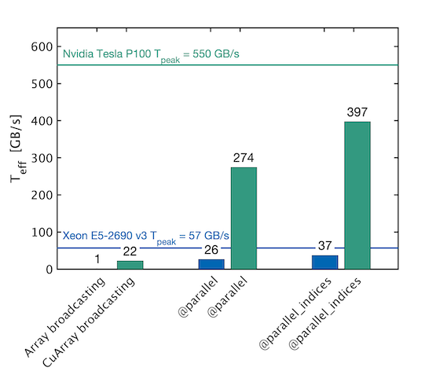
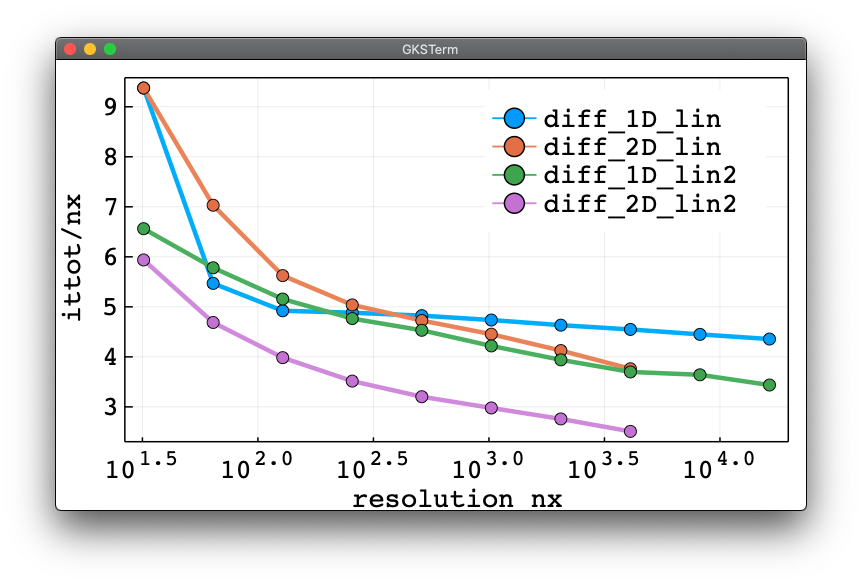
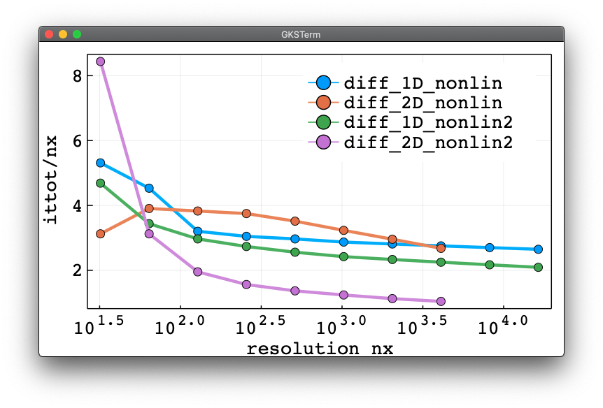

# PseudoTransientDiffusion.jl

This repository contains various diffusion solvers to examplify, test and asses the performance of the pseudo-transient method, including the convergence acceleration via damping (second order Richardson method \[[Frankel, 1950](https://doi.org/10.2307/2002770)\]).

🚧 work in progress - more to come soon.

💡 Link to the [Overleaf draft](https://www.overleaf.com/project/5ff83a57858b372f63143b8e)

## Content
* [The diffusion equation](#the-diffusion-equation)
* [Scripts](#scripts)
* [Results](#results)
* [References](#references)

## The diffusion equation
In this study we will use the (non-linear) diffusion (reaction) equation in 1D, 2D and 3D.

### The 1D diffusion
The linear equation has `D=1` while the nonlinear version considers the case `D=H^3`:
```julia
qHx   = -D*dH/dx
dH/dt = -dqHx/dx
```
### The 2D diffusion
The linear equation has `D=1` while the nonlinear version considers the case `D=H^3`:
```julia
qHx   = -D*dH/dx
qHy   = -D*dH/dy
dH/dt = -(dqHx/dx + dqHy/dy)
```
### The 3D diffusion
The linear equation has `D=1` while the nonlinear version considers the case `D=H^3`:
```julia
qHx   = -D*dH/dx
qHy   = -D*dH/dy
qHz   = -D*dH/dz
dH/dt = -(dqHx/dx + dqHy/dy + dqHz/dz)
```

## Scripts
- The [`diff_1D_lin.jl`](scripts/diff_1D_lin.jl) scripts solves the linear (`D=1`) [1D diffusion equation](#the-1d-diffusion) including damping to accelerate convergence.
- The [`diff_1D_lin2.jl`](scripts/diff_1D_lin2.jl) scripts solves the linear (`D=1`) [1D diffusion equation](#the-1d-diffusion) including a new convergence acceleration.
- The [`diff_1D_linstep.jl`](scripts/diff_1D_linstep.jl) scripts solves the [1D diffusion equation](#the-1d-diffusion) with a 1e4 contrast in values of the diffusion coefficient including damping to accelerate convergence.
- The [`diff_1D_linstep2.jl`](scripts/diff_1D_linstep2.jl) scripts solves the [1D diffusion equation](#the-1d-diffusion) with a 1e4 contrast in values of the diffusion coefficient including a new convergence acceleration.
- The [`diff_1D_nonlin.jl`](scripts/diff_1D_nonlin.jl) scripts solves the nonlinear (`D=H^3`) [1D diffusion equation](#the-1d-diffusion) including damping to accelerate convergence.
- The [`diff_1D_nonlin2.jl`](scripts/diff_1D_nonlin2.jl) scripts solves the nonlinear (`D=H^3`) [1D diffusion equation](#the-1d-diffusion) including a new convergence acceleration.
---
- The [`diff_2D_lin.jl`](scripts/diff_2D_lin.jl) scripts solves the linear (`D=1`) [2D diffusion equation](#the-2d-diffusion) including damping to accelerate convergence.
- The [`diff_2D_lin2.jl`](scripts/diff_2D_lin2.jl) scripts solves the linear (`D=1`) [2D diffusion equation](#the-2d-diffusion) including a new convergence acceleration.
- The [`diff_2D_linstep.jl`](scripts/diff_2D_linstep.jl) scripts solves the [2D diffusion equation](#the-2d-diffusion) with a 1e4 contrast in values of the diffusion coefficient including damping to accelerate convergence.
- The [`diff_2D_linstep2.jl`](scripts/diff_2D_linstep2.jl) scripts solves the [2D diffusion equation](#the-2d-diffusion) with a 1e4 contrast in values of the diffusion coefficient including a new convergence acceleration.
- The [`diff_2D_nonlin.jl`](scripts/diff_2D_nonlin.jl) scripts solves the nonlinear (`D=H^3`) [2D diffusion equation](#the-2d-diffusion) including damping to accelerate convergence.
- The [`diff_2D_nonlin2.jl`](scripts/diff_2D_nonlin2.jl) scripts solves the nonlinear (`D=H^3`) [2D diffusion equation](#the-2d-diffusion) including a new convergence acceleration.
---
- The [`diff_3D_lin.jl`](scripts/diff_3D/diff_3D_lin.jl) scripts solves the linear (`D=1`) [3D diffusion equation](#the-3d-diffusion) including damping to accelerate convergence.
- The [`diff_3D_lin2.jl`](scripts/diff_3D/diff_3D_lin2.jl) scripts solves the linear (`D=1`) [3D diffusion equation](#the-3d-diffusion) including a new convergence acceleration.
- The [`diff_3D_linstep.jl`](scripts/diff_3D/diff_3D_linstep.jl) scripts solves the [3D diffusion equation](#the-3d-diffusion) with a 1e4 contrast in values of the diffusion coefficient including damping to accelerate convergence.
- The [`diff_3D_linstep2.jl`](scripts/diff_3D/diff_3D_linstep2.jl) scripts solves the [3D diffusion equation](#the-3d-diffusion) with a 1e4 contrast in values of the diffusion coefficient including a new convergence acceleration.
- The [`diff_3D_nonlin.jl`](scripts/diff_3D/diff_3D_nonlin.jl) scripts solves the nonlinear (`D=H^3`) [3D diffusion equation](#the-3d-diffusion) including damping to accelerate convergence.
- The [`diff_3D_nonlin2.jl`](scripts/diff_3D/diff_3D_nonlin2.jl) scripts solves the nonlinear (`D=H^3`) [3D diffusion equation](#the-3d-diffusion) including a new convergence acceleration.
---
- The `perf_diff_2D_nonlin_perfcompare_xx.jl` scripts solve the nonlinear [2D diffusion equation](#the-2d-diffusion) are used to generate the following figure (used in the [ParallelStencil.jl] repo):



## Results
Scaling analysis - iteration count normalised by grid resolution in x direction (`nx`) as function of `nx` comparing

- the linear 1D and 2D diffusion equation using damping and new damping `2` approach:



- the nonlinear (`D=H^3`) 1D and 2D diffusion equation using damping and new damping `2` approach:



## References
[Frankel, S. P. (1950). Convergence rates of iterative treatments of partial differential equations, Mathe. Tables Other Aids Comput., 4, 65–75.](https://doi.org/10.2307/2002770)


[ParallelStencil.jl]: https://github.com/omlins/ParallelStencil.jl
